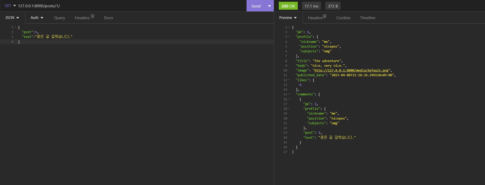

# API-for-community_board

게시판을 위한 DRF 기반 API 프로젝트입니다.

댓글 및 좋아요, 회원 및 로그인 기능, 글 작성과 수정 및 삭제 기능을 구현했습니다.


Requirements
```
asgiref==3.6.0
dj-database-url==1.3.0
Django==4.2
django-environ==0.10.0
django-filter==2.4.0
djangorestframework==3.12.2
gunicorn==20.1.0
Pillow==9.5.0
psycopg2-binary==2.9.6
pytz==2023.3
sqlparse==0.4.3
typing_extensions==4.5.0
tzdata==2023.3
whitenoise==6.4.0
```

# 캡쳐

